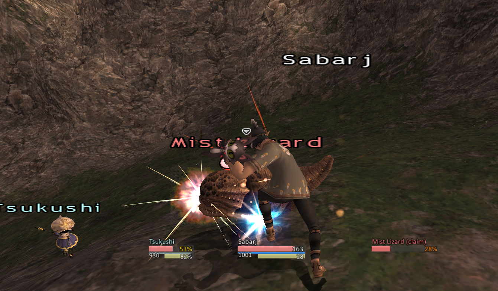
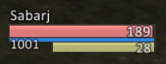
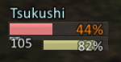
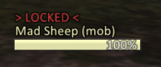
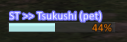
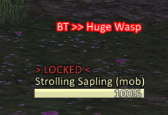
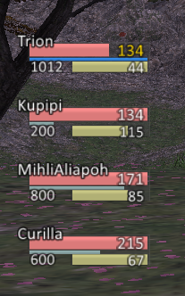
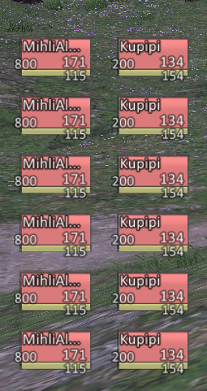

# Eris Unit Frames for FFXI (Final Fantasy 11)
Simple unit frames for Final Fantasy 11 (retail). Windower 4 required.


## Whats in it?
### Player frame

- Shows HP, MP, and TP
- Low health indicator (for undead aggro)
- Can hide out-of-combat
- Default interactions: left click to target yourself

### Pet frame

- Shows HP
- Shows MP and TP, if they are available (usually with combat actions)
- Low health indicator
- Can hide out-of-combat
- Default interactions: left click to target your pet

### Target frame

- Shows HP
- Low health indicator
- Locked text indicator
- Color varies by target type
- Default interactions: right click to `/check` target

### Sub target frame

- Shows HP
- Low health indicator
- Color varies by target type
- Bright outline to clearly show that you have the sub-targeting arrow up

### Battle target frame

- Bright outline to clearly show that you are not engaged with the battle target
- Only shows if your current target is NOT the battle target
- Default interactions: left click to `/attack` battle target, right click to just target it

### Party frames

- Shows HP, MP, and TP, if available (same zone)
- Shows zone name if not in zone
- Low health indicator (for undead aggro)
- Can hide out-of-combat
- Default interactions: left click to target party member

### Alliance frames

- Shows HP, MP, and TP, if available (same zone)
- Shows zone name if not in zone
- Low health indicator (for undead aggro)
- Can hide out-of-combat
- Default interactions: left click to target alliance member

### Everything loaded at once


## Configuration
An in-game configuration is provided as follows:

```
//euf help
```
shows help text.


```
//euf unlock
```
allows the UI elements to be moved with the mouse.


```
//euf lock
```
disallows the UI elements to be moved.


```
//euf theme <name>
```
applies the given theme file to the unit frames (default is 'ff11', 'wowspiration' also available).


```
//euf save
```
saves the position of the unit frames and the theme.


```
//euf reset
```
reverts all settings to the default.


```
//euf reload
```
reloads the UI and undos any unsaved changes.


Note that the default configuration is for a standard 1080p layout, mimicing the FF11 color scheme by default, with frames positioned in a World of Warcraft style.
The frames are very highly configurable outside of the default layout.

## Advanced configuration
Once the addon has been loaded and the player logged, in, a `data/settings.xml` file will be available for more advanced configuration. This allows various UI elements to be turned on and off, plus it allows more in-depth customization of the text that appears on the frames.

### Text Data Placeholder Reference

| Placeholder     | Description                             | Pet ?     | Notes
|-----------------|-----------------------------------------|-----------|---------------------
| `%name`         | Shows the entity's full name            | Yes       |
| `%name_short`   | Shows a shorter version of the name     | Yes       |
| `%mob_type`     | The type of mob (pc, npc, etc)          | Yes       |
| `%distance`     | Shows the distance to the mob           | Yes       |
| `%hp_current`   | Current HP of the entity                | PUP only  |
| `%hp_max`       | Maximum HP of the entity                | PUP only  | Estimated for party
| `%hp_percent`   | HP percentage of the entity             | Yes       |
| `%tp_current`   | Current TP of the entity                | Yes       |
| `%tp_max`       | Static value for maximum TP             | Yes       |
| `%tp_percent`   | TP percentage of the entity             | Yes       |
| `%mp_current`   | Current MP of the entity                | PUP only  |
| `%mp_max`       | Maximum MP of the entity                | PUP only  | Estimated for party
| `%mp_percent`   | MP percentage of the entity             | Yes       |
| `%id`           | The entity's ID in base 10              | Yes       |
| `%idh`          | The entity's ID in base 8               | Yes       |
| `%id3`          | The entity's ID in base 10, last 3 only | Yes       |
| `%idh3`         | The entity's ID in base 8, last 3 only  | Yes       |
| `%speed`        | Speed of the entity                     | No        |
| `%x`            | X-coordinate of the entity              | Yes       |
| `%y`            | Y-coordinate of the entity              | Yes       |
| `%z`            | Z-coordinate of the entity              | Yes       |
| `%zone`         | The zone of the entity                  | No        |
| `%zone_short`   | Short version of the zone name          | No        |

## Installation
Download and extract to `windower/addons/` -- make sure the `erisunitframes.lua` file is in an `erisunitframes` folder in that addons folder. Afterwards, edit `windower/scripts/init.txt` and add `lua load erisunitframes` to the end.